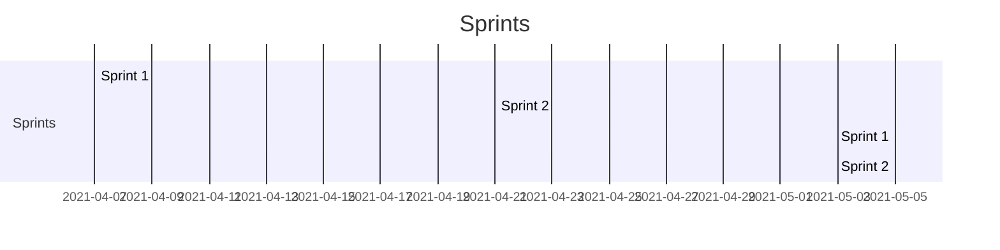

Recommendation App
===
:::info
**Product name**: RecoMedia (placeholder)
**Team name**: *Three three musketeers and three other dudes that may or may not be musketeers*
**Release name:** RecoMedia 1
**Release date:** 06-02-2021
:::
*Revision number: 1.0
Revision date: 4/5/2021*

## Table of Contents

[TOC]

## High End Goals 

- User friendly/catchy GUI to encourage interactivity around interesting movies
- Get data from movies API and parse them related to personalized data
- Display movies on website 
- Have a moderation system with UI to ensure site does not get clunky 
- extra: Create incentive system for users to continue coming back

User stories
---
### Sprint #1 (4/7/2021 -> 4/21/2021):
- frontend (3 pages)
    - Home (Nick)
        - As a user, I’d like to be able to have an organized home page that can link me to a list of movies that fit my style, but also that has information explaining the site and how to use it. This is because I may be unfamiliar with the site and its usage, and would like to have as easy an experience as possible while getting the maximum out of the utilities.
    - List (Zach)
        - As a user, I want to see all the movies in a list, so that I can choose which ones to watch (highest priority) 
    - Individual Movie (Jeff)
        - (3 pts) As a user, I’d like to be able to see detailed information about a movie, so I can see if it’ll entertain my interest. 
        - (2 pts) As a user, I’d like to see a tab with similar movies, so I can generate a watchlist of a certain genre/theme.

- Backend 
    - Database
        - (3 pts) As a back-end developer, I would like a set of functions to be able to access, store, and obtain data from the database so that I can send data to the user and store data from an API/user
Send data
        - (2 pts) As a back-end developer, I would like functions to be able to send data to the front end so that whenever the user requests a list of movies, I can send it
Obtain data from IMDB
        - (3 pts) As a user, I would like to be able to obtain data from IMDB so that we have a list of all the movies available

### Sprint #2 (4/21/2021 -> 5/5/2021): 
- Frontend: 
    - List
        - As a user, I want to sort, filter, and search the list so that I can find a specific movie
    - Login/Signup
        - (2 pts) As a user, I want to be able to create an account so that I can save my movie preferences
    - Profile 
        - As a user, I want to list and review movies on a profile so I can personalize my experience better.
- Backend: 
    - Algorithm: 
       - As a User, I would like a simple algorithm that sorts by genre/themes so I can see similar movies that I like and am used to. 

    -  Authentication/Security: 
        -  As a User, I would like to have my personal information secure so I am not targeted for malicious activities. 

### Sprint #3 (5/5/2021 -> 5/19/2021): 
- Frontend
    - List
        - As a user, I want to see a list of recommended movies based on my preferences, so that I can find new and interesting movies
        - As a user, I want to be able to like/dislike movies in the list, and save them to my profile, so that I can see relevant recommendations
    - Profile
        -  As a user, I want to be able to have the movies that I have watched, liked, and reviewed on my profile.
- Backend: 
    - Algorithm: 
        - (5 pts) As a user, I would like to only see good ratings recommended to me, so I don’t end up wasting time on a bad one. 

    - Moderation System: 
        - (2 pts) As a web-admin, I would like a simpler way to interact with the site so I can make sure the website is clean. 

### Sprint #4  (5/19/2021 -> 6/2/2021):
- Frontend
    - Individual Movie
        - As a user, I want to be able to leave comments on a movie, and respond to other users comments so that I can share my opinions and see other people’s opinions
    - Social Media
        - As a user, I want to share my movie list on social media so that I can show all my friends

Product Backlog
---
1. Product Backlog: 
2. User login or Guest 
3. Movie information display
4. Algorithm to recommend shows and movies.
5. Have the algorithm recommend video games
6. Ability to save your movies into you personalized list
7. Various tabs such as movie recommendations, reviews, summary, places you can watch, actors in there
8. Social media trends 
9. dynamically update (IMDB api), 
10. change recommendations based on previously watched.

Project Timeline
---

